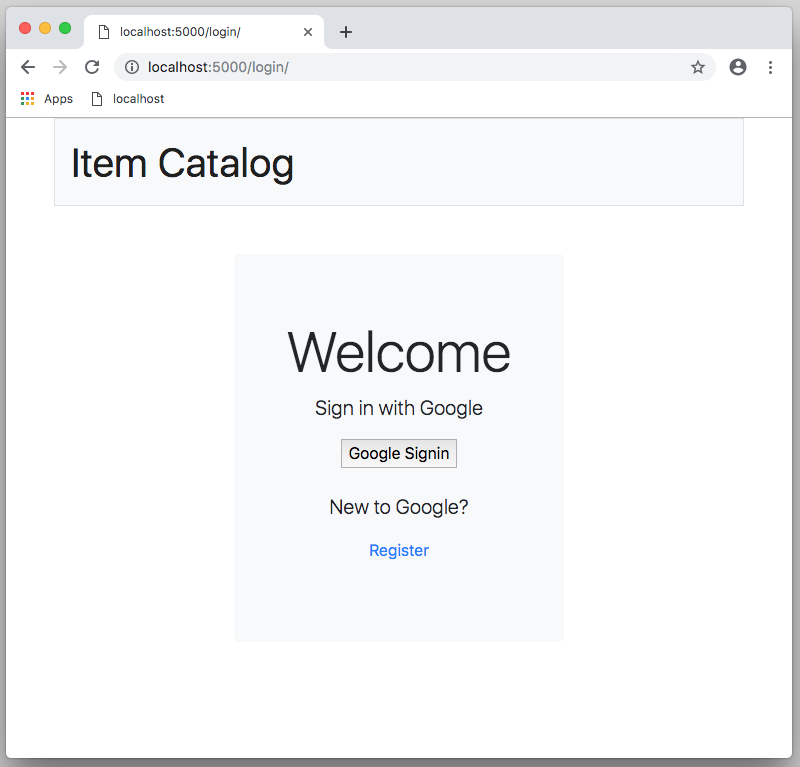

# Catalog

### Description

application.py is the project 2 requirement of the Udacity Full Stack Developer Nanodegree Program.   application.py is an online item catalog that provides a list of items within a variety of categories.  application.py utilizes Google OAuth 2.0 to provide users with the ability to post, edit, and delete thier own items in the catalog.   This project was created with the Flask framework.

The purpose of this project is to obtain and practice the following skills:

- Utilizing Flask framework
- Creating a RESTful web application
- Implementing third-party OAuth authentication
- Mapping HTTP methods to CRUD I(create, read, update, and delete) operations

### Requirements

- VirtualBox
- Vagrant
- Udacity Full Stack Developer Nanodegree virtual machine (VM)
- Python 2.x
- SQLite
- catalog.db database file
- Flask


### Installation

Download and install [VirtualBox](https://www.virtualbox.org/wiki/Download_Old_Builds_5_1) and [Vagrant](https://www.vagrantup.com/downloads.html) for your operating system.

Clone the fullstack-nanodegree-vm at (https://github.com/chriskelleyGH/fullstack-nanodegree-vm/tree/master/vagrant/catalog).

The fullstack-nanodegree-vm will contain the necessary files and dependencies to run the application.

### Run Catalog Application

Navigate to the vagrant directory, start the vagrant virtual machine, and ssh into the machine.

```sh
$ ls vagrant
$ vagrant up
$ vagrant ssh
```

Start the catalog application.

```sh
$ cd /vagrant/catalog
$ python application.py
```

### Example Usage


.
.
.
.
.
.
.
.
.
.
.
.
.
.
.





### License

This is free and unencumbered software released into the public domain.

Anyone is free to copy, modify, publish, use, compile, sell, or distribute this software, either in source code form or as a compiled binary, for any purpose, commercial or non-commercial, and by any means.

In jurisdictions that recognize copyright laws, the author or authors of this software dedicate any and all copyright interest in the software to the public domain. We make this dedication for the benefit of the public at large and to the detriment of our heirs and successors. We intend this dedication to be an overt act of relinquishment in perpetuity of all present and future rights to this software under copyright law.

THE SOFTWARE IS PROVIDED "AS IS", WITHOUT WARRANTY OF ANY KIND, EXPRESS OR IMPLIED, INCLUDING BUT NOT LIMITED TO THE WARRANTIES OF MERCHANTABILITY, FITNESS FOR A PARTICULAR PURPOSE AND NONINFRINGEMENT. IN NO EVENT SHALL THE AUTHORS BE LIABLE FOR ANY CLAIM, DAMAGES OR OTHER LIABILITY, WHETHER IN AN ACTION OF CONTRACT, TORT OR OTHERWISE, ARISING FROM, OUT OF OR IN CONNECTION WITH THE SOFTWARE OR THE USE OR OTHER DEALINGS IN THE SOFTWARE.

For more information, please refer to <http://unlicense.org>
